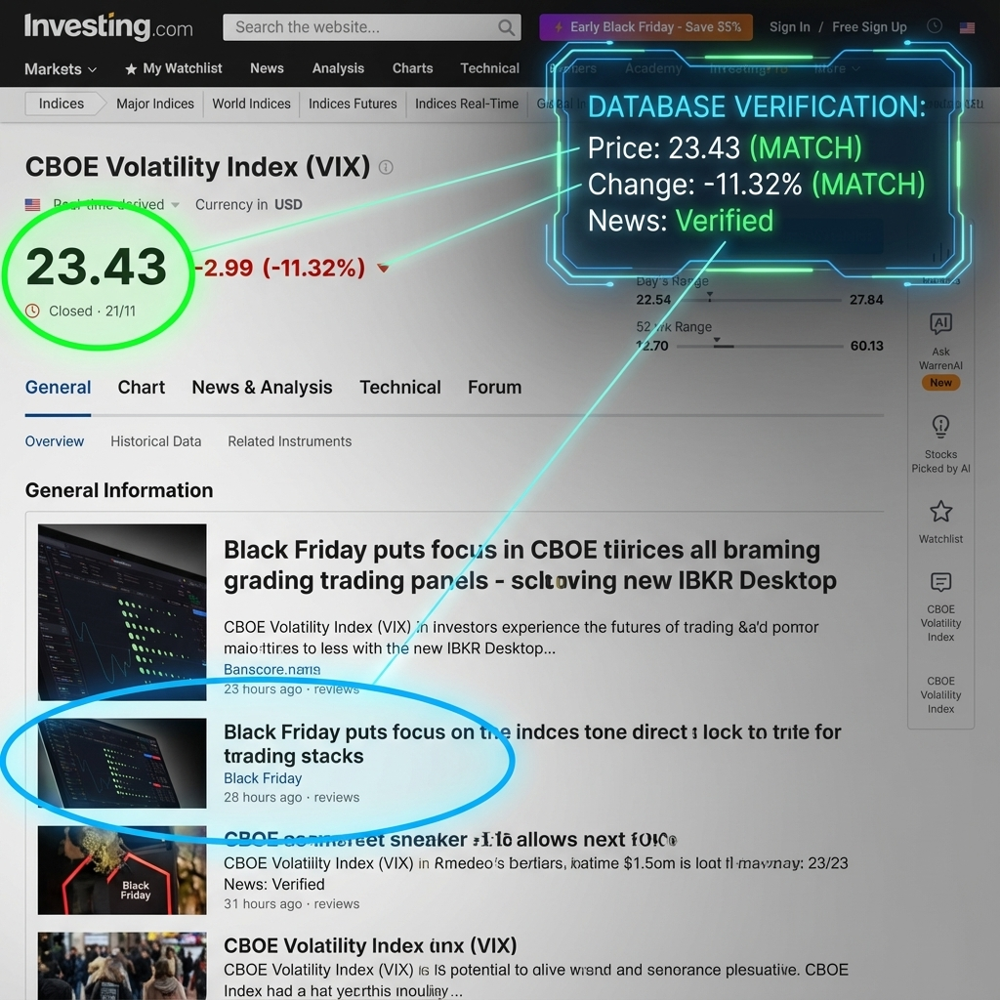

[](https://www.typescriptlang.org/)
[](https://nodejs.org/)
[](https://www.postgresql.org/)
[](https://x.ai/)
[](https://opensource.org/licenses/ISC)

  <p align="center">
    <a href="#-quick-start">Quick Start</a> •
    <a href="#-features">Features</a> •
    <a href="#-installation">Installation</a> •
    <a href="#-usage">Usage</a> •
    <a href="#-architecture">Architecture</a> •
    <a href="#documentation">Documentation</a>
  </p>
</div>

---

## 🎯 Quick Start

### Prerequisites

- **Node.js** 18+
- **PostgreSQL** 13+
- **KiloCode AI** (x-ai/grok-code-fast-1)

### One-Command Setup

```bash
# Clone & Install
git clone <repo-url>
cd financial-analyst
pnpm install

# Configure Database
cp .env.example .env
# Edit .env with your PostgreSQL credentials:
# DB_HOST=localhost
# DB_PORT=5432
# DB_USER=postgres
# DB_PASSWORD=your_password
# DB_NAME=financial_analyst

# Initialize Database
ts-node create_database.ts

# Run First Analysis
pnpm analyze
```

---

## 🚀 Features

### ✅ **Core Capabilities**

- **🤖 KiloCode AI Integration** - Advanced sentiment analysis using x-ai models
- **📊 Database-Driven Analysis** - 22+ news items from PostgreSQL database
- **🚫 No Fallback Policy** - Returns "N/A" when analysis fails (no simulated data)
- **⚡ Real-Time Processing** - 3-5 second analysis time with cached data
- **📈 ES Futures Focus** - Optimized for S&P 500 futures sentiment analysis
- **📉 VIX Volatility Analysis** - Real-time VIX scraping & verification (Investing.com/MarketWatch)
- **🤖 Discord Bot** - 24/7 Market Assistant with commands (!sentiment, !vix, !rougepulse, !vortex500, !newsagg, !tescraper, !vixscraper) and daily briefings

### 🎛️ **Operating Modes**

- **Single Analysis** - One-time sentiment analysis
- **Continuous Monitoring** - Automated analysis every 5 minutes
- **Database Status** - View cache status and news statistics

### 1. Clone Repository

```bash
git clone https://github.com/Terlou06/Financial-Analyst.git
cd financial-analyst
```

### 2. Install Dependencies

```bash
pnpm install
```

### 3. Database Setup

```bash
# Create .env file
cp .env.example .env

# Edit .env with your PostgreSQL settings:
DB_HOST=localhost
DB_PORT=5432
DB_USER=postgres
DB_PASSWORD=9022
DB_NAME=financial_analyst

# Create database
ts-node create_database.ts
```

### 4. Verify Installation

```bash
# Test database connection
pnpm status

# Run first analysis
pnpm analyze
```

---

## 🎮 Usage

### Main Application (run.ts)

The primary entry point with multiple operating modes:

```bash
# Single sentiment analysis (via Vortex500Agent)
pnpm vortex500
# or
ts-node -e "import { Vortex500Agent } from './src/backend/agents/Vortex500Agent'; const agent = new Vortex500Agent(); agent.analyzeMarketSentiment().then(console.log);"

# Continuous monitoring (12-hour intervals)
pnpm continuous
# or
ts-node run.ts --continuous

# Database status
pnpm status
# or
ts-node run.ts --status

# Refresh news data
pnpm refresh
# or
ts-node run.ts --refresh

# Run VIX scraper (All sources)
pnpm vix:scrape
# or
ts-node run.ts --vix-scrape

# Run MarketWatch scraper only
pnpm scrape:mw
# or
ts-node run.ts --scrape-mw

# Run Investing.com scraper only
pnpm scrape:inv
# or
ts-node run.ts --scrape-inv

# Run VIX analysis (Scrape + AI)
pnpm vix:analyze
# or
ts-node run.ts --vix-analyze

# Start Discord Bot
pnpm bot
# Commands: !sentiment, !vix, !rougepulse, !vortex500, !newsagg, !tescraper, !vixscraper
```

### Package.json Scripts

```json
{
  "scripts": {
    "analyze": "ts-node run.ts --analyze",
    "continuous": "ts-node run.ts --continuous",
    "status": "ts-node run.ts --status",
    "refresh": "ts-node run.ts --refresh",
    "vix:scrape": "ts-node run.ts --vix-scrape",
    "vix:analyze": "ts-node run.ts --vix-analyze",
    "scrape:mw": "ts-node run.ts --scrape-mw",
    "scrape:inv": "ts-node run.ts --scrape-inv",
    "bot": "ts-node src/discord_bot/index.ts",
    "vortex500": "ts-node -e \"import { Vortex500Agent } from './src/backend/agents/Vortex500Agent'; const agent = new Vortex500Agent(); agent.analyzeMarketSentiment().then(console.log);\"",
    "rouge:pulse": "ts-node src/backend/scripts/run_rouge_pulse.ts",
    "scrape:te": "ts-node src/backend/scripts/scrape_trading_economics.ts",
    "pipeline": "ts-node src/backend/scripts/run_news_data_pipeline.ts",
    "sentiment": "ts-node src/backend/scripts/run_agent_sentiment.ts",
    "db:analyze": "ts-node src/backend/scripts/database_analysis.ts",
    "test:scrapers": "ts-node src/backend/scripts/test_scrapers.ts"
  }
}
```

### Example Output

```
🚀 Initializing Financial Analyst Application...
============================================================
✅ Database connection successful

📊 Database Status:
   ├─ News items: 22
   ├─ Cache: FRESH
   └─ Time range: Last 48 hours

🔍 Starting Market Sentiment Analysis...
============================================================
✅ ANALYSIS COMPLETED SUCCESSFULLY!

📈 MARKET SENTIMENT RESULT:
{
  "sentiment": "BEARISH",
  "score": -45,
  "risk_level": "HIGH",
  "catalysts": [
    "Bitcoin slide threatening $80,000 break",
    "AI CapEx masking economic weakness",
    "Geopolitical tensions and regulatory pressures"
  ],
  "summary": "Mixed headlines with strong bearish signals...",
  "data_source": "database_cache",
  "news_count": 22,
  "analysis_method": "robust_kilocode_v2"
}

🎯 KEY INSIGHTS:
   Sentiment: BEARISH (-45/100)
   Risk Level: HIGH
   Catalysts: Bitcoin slide threatening $80,000 break, AI CapEx masking economic weakness...
   Summary: Mixed headlines with strong bearish signals from Bitcoin declines...
   News Count: 22 items
   Data Source: database_cache
   Analysis Method: robust_kilocode_v2
```

---

## 🏗 Architecture

### 🎯 System Overview


### 🤖 Vortex500Agent (Core Sentiment Agent)

```
Vortex500Agent
├── Database-Only Mode
│   ├── Extracts news from PostgreSQL (48h window)
│   ├── Uses TOON format for KiloCode processing
│   └── No web scraping - pure database analysis
├── KiloCode Integration
│   ├── Sends structured prompt with 22+ news items
│   ├── Returns JSON with sentiment/score/catalysts
│   └── No fallbacks - returns N/A on failure
└── Database Buffer
    ├── Creates database.md file for inspection
    ├── Maintains transparency of AI input
    └── Preserves analysis workflow
```

### 💾 Database Schema

#### **Core Tables Structure**

```sql
-- 📰 news_items (Articles financiers)
├── id UUID PRIMARY KEY
├── title VARCHAR(500)              -- Titre de l'article
├── source VARCHAR(50)              -- Source (ZeroHedge, CNBC, etc.)
├── url TEXT                       -- URL de l'article
├── content TEXT                    -- Contenu optionnel
├── sentiment VARCHAR(20)           -- Sentiment optionnel
├── created_at TIMESTAMP           -- Date de création
├── updated_at TIMESTAMP           -- Date de mise à jour

-- 📊 sentiment_analyses (Analyses de sentiment)
├── id UUID PRIMARY KEY
├── analysis_date DATE              -- Date de l'analyse
├── overall_sentiment VARCHAR(20)   -- bullish/bearish/neutral
├── score INTEGER                   -- Score -100 à +100
├── risk_level VARCHAR(20)          -- low/medium/high
├── confidence_score FLOAT          -- Score de confiance 0-1
├── catalysts JSONB                 -- Array des catalystes principaux
├── summary TEXT                    -- Résumé de l'analyse
├── news_count INTEGER              -- Nombre d'articles analysés
├── metadata JSONB                  -- Métadonnées additionnelles
├── is_validated BOOLEAN DEFAULT FALSE
└── created_at TIMESTAMP           -- Date de création

-- 📡 news_sources (Configuration des sources)
├── id UUID PRIMARY KEY
├── name VARCHAR(100)               -- Nom de la source
├── url VARCHAR(500)                -- URL de la source
├── type VARCHAR(50)                -- RSS/WEB/API
├── is_active BOOLEAN DEFAULT TRUE  -- Source activée?
├── last_fetch TIMESTAMP            -- Dernière récupération
├── success_rate FLOAT              -- Taux de succès
├── error_count INTEGER DEFAULT 0   -- Compteur d'erreurs
└── created_at TIMESTAMP

-- 🔍 scraping_sessions (Sessions de collecte)
├── id UUID PRIMARY KEY
├── session_start TIMESTAMP         -- Début de session
├── session_end TIMESTAMP           -- Fin de session
├── articles_found INTEGER          -- Articles trouvés
├── articles_saved INTEGER          -- Articles sauvegardés
├── success BOOLEAN                 -- Succès de la session
├── error_message TEXT              -- Message d'erreur
└── created_at TIMESTAMP

-- 🔴 rouge_pulse_analyses (Analyses calendrier économique)
├── id UUID PRIMARY KEY
├── impact_score INTEGER            -- Score d'impact 0-100
├── market_narrative TEXT           -- Narratif de marché
├── high_impact_events JSONB        -- Événements à fort impact
├── asset_analysis JSONB            -- Analyse par actif
├── trading_recommendation TEXT     -- Recommandation de trading
├── raw_analysis JSONB              -- Analyse brute
└── created_at TIMESTAMP

-- 📅 economic_events (Calendrier économique)
├── id UUID PRIMARY KEY
├── event_date TIMESTAMP            -- Date de l'événement
├── country VARCHAR(100)            -- Pays
├── event_name VARCHAR(500)         -- Nom de l'événement
├── importance INTEGER              -- Importance 1-3
├── actual VARCHAR(50)              -- Valeur actuelle
├── forecast VARCHAR(50)            -- Prévision
├── previous VARCHAR(50)            -- Valeur précédente
├── currency VARCHAR(20)            -- Devise
├── source VARCHAR(50)              -- Source (TradingEconomics)
└── created_at TIMESTAMP

-- Tables additionnelles (optimisation)
├── daily_news_summary              -- Résumés quotidiens
├── latest_news                     -- Cache des dernières news
├── recent_sentiment_analyses       -- Cache des analyses récentes
└── source_performance              -- Stats de performance par source
```

#### **Database Connection**

See `.env.example` for configuration details.

#### **Key Features**

- ✅ **22+ articles financiers** analysés en temps réel
- ✅ **Cache intelligent** de 2 heures (TTL configurable)
- ✅ **Nettoyage automatique** (>30 jours pour les anciennes données)
- ✅ **Indexes optimisés** pour les requêtes fréquentes
- ✅ **Monitoring santé** des sources de news
- ✅ **JSONB columns** pour données flexibles (catalysts, metadata)
- ✅ **Historique complet** des analyses de sentiment
- ✅ **Performance tracking** par source

#### **pgAdmin 4 Quick Access**

📄 **Documentation complète**: [doc/commandes_pg_sql.md](doc/commandes_pg_sql.md)

Requête complète pour pgAdmin 4 disponible dans `/doc/commandes_pg_sql.md`

### 🔄 Processing Pipeline

```
PostgreSQL Database (48h news)
        ↓
SentimentAgentFinal (TOON format)
        ↓
KiloCode AI Analysis
        ↓
Structured JSON Result
        ↓
Database Storage + Display
```

---

## 📊 Sentiment Analysis Format

### JSON Output Structure

```json
{
  "sentiment": "BEARISH", // BULLISH | BEARISH | NEUTRAL
  "score": -45, // -100 to +100
  "risk_level": "HIGH", // LOW | MEDIUM | HIGH
  "catalysts": [
    // Key market drivers
    "Bitcoin slide threatening $80,000 break",
    "AI CapEx masking economic weakness",
    "Geopolitical tensions and regulatory pressures"
  ],
  "summary": "Market sentiment analysis summary...",
  "data_source": "database_cache", // Source of analysis data
  "news_count": 22, // Number of news items analyzed
  "analysis_method": "robust_kilocode_v2" // Processing method
}
```

### Error Handling

- **N/A Response** - When KiloCode fails, returns structured N/A result
- **Database Fallback** - Continues without database if connection fails
- **Timeout Protection** - 60-second timeout prevents hanging
- **Graceful Degradation** - Always provides a response, never crashes

---

## 📚 Documentation

### Core Files

- **`run.ts`** - Main application entry point with CLI interface
- **`Vortex500Agent.ts`** - Robust sentiment analysis agent
- **`NewsDatabaseService.ts`** - Database operations and caching
- **`schema.sql`** - PostgreSQL schema definition

### Configuration

- **`.env`** - Database connection settings
- **`package.json`** - Dependencies and npm scripts
- **`database.md`** - Generated buffer file for AI input inspection

### Test Scripts

- **`test_final_sentiment.ts`** - Agent functionality testing
- **`test_database_connection.ts`** - Database connectivity tests
- **`fix_database.ts`** - Database repair utilities
- **`test_scrapers.ts`** - Scraper functionality testing
- **`test_newsagg.ts`** - News aggregator testing
- **`test_vixombre_expert.ts`** - VIX agent expert testing
- **`test_vixombre.ts`** - VIX agent testing
- **`test_discord_token.ts`** - Discord bot token testing

---

## 🛠 Development

### Environment Setup

```bash
# Development mode
pnpm dev

# TypeScript compilation
pnpm build

# Run tests
pnpm test
```

### Adding New Features

1. **Create new agent** extending `BaseAgentSimple`
2. **Update database schema** in `schema_simplified.sql`
3. **Add npm script** to `package.json`
4. **Update CLI interface** in `run.ts`

### Monitoring & Debugging

```bash
# Database statistics
pnpm status

# View database buffer (created during analysis)
cat database.md

# Check database logs
# PostgreSQL logs contain detailed operation information
```

---

## 🔧 Troubleshooting

### Common Issues

**Database Connection Failed**

```bash
# Check PostgreSQL is running
pg_isready -h localhost -p 5432

# Verify credentials in .env
# Test connection manually
psql -h localhost -U postgres -d financial_analyst
```

**KiloCode Analysis Failed**

```bash
# Check KiloCode installation
kilocode --version

# Test KiloCode directly
echo "Analyze market sentiment" | kilocode -m ask --auto --json
```

**No News in Database**

```bash
# Run news ingestion first
ts-node src/backend/ingestion/NewsAggregator.ts

# Check database status
pnpm status
```

### Error Messages Explained

- **"Analysis not available: Database not available"** - Database connection failed
- **"KiloCode analysis failed"** - AI service unavailable or error
- **"No news data available in database"** - Empty database, run ingestion first

---

- [ ] **Advanced Caching** - Redis integration for performance

### ✅ **VIX Data Verification**

The system includes a powerful verification module for VIX data scraping. It can automatically:

1.  **Capture real-time screenshots** of source websites (Investing.com, MarketWatch).
2.  **Compare scraped data** against the visual evidence.
3.  **Generate proof images** with annotated matches.



_Above: Automated verification showing exact match between scraped database values and the live website interface._

---

## 📄 License

This project is licensed under the **ISC License** - see [LICENSE](LICENSE) for details.

---

<div align="center">

**🚀 Production-Ready Financial Sentiment Analysis System**

_Built with ❤️ using TypeScript, PostgreSQL, and KiloCode AI_

[⭐ Star This Repo] • [🐛 Report Issues] • [📖 Documentation] • [🤝 Contributing]

</div>
